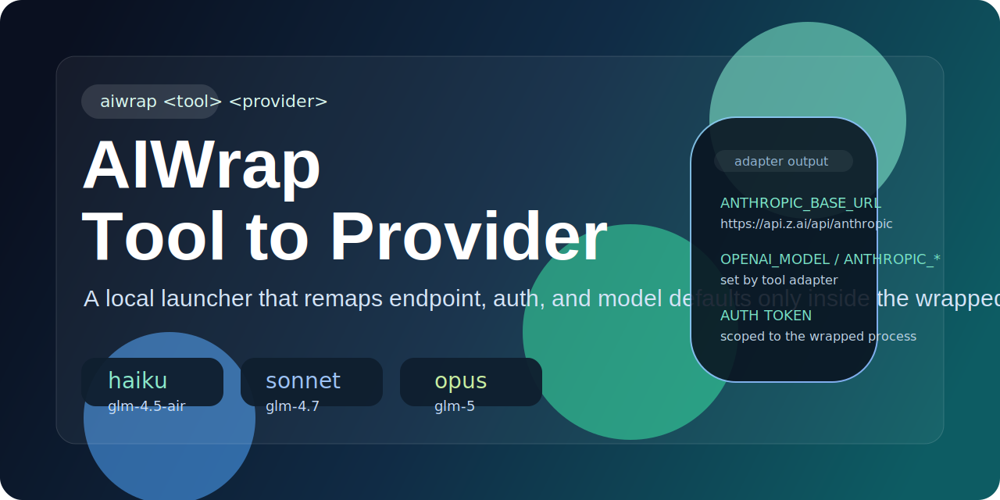

<p align="center">
  
</p>

# AIWrap

`aiwrap` is a small launcher that lets one local AI CLI run against a different backend provider.

The core command shape is:

```bash
aiwrap <tool> <provider> [tool args...]
```

This repo currently supports:

- `aiwrap claude glm`
- `aiwrap codex claude`

It also installs a convenience shell function:

```bash
glm() { aiwrap claude glm "$@"; }
```

So `glm` remains the fast path for the original Claude-on-GLM workflow, while `aiwrap` is the real implementation surface.

## What It Does

AIWrap composes two layers:

- a **tool adapter** for the local CLI you want to launch
- a **provider profile** for the backend you want that CLI to talk to

For example:

- `aiwrap claude glm` launches the local `claude` binary with Anthropic-style environment variables pointed at GLM / Z.ai
- `aiwrap codex claude` launches the local `codex` binary with OpenAI-style environment variables pointed at a Claude provider profile

What wrappers like this can do well:

- swap base URLs
- swap auth token sources
- set default model mappings
- isolate those changes to the wrapped child process

What they do **not** guarantee:

- full protocol translation between incompatible ecosystems
- identical streaming behavior
- identical tool-calling semantics
- support for every feature each upstream CLI may assume

This version is intentionally explicit: unsupported tool/provider pairs fail instead of guessing.

## Supported Tools

- `claude`
- `codex`

## Supported Providers

- `glm`
- `claude`

## Supported Pairs

| Command | Meaning |
| --- | --- |
| `aiwrap claude glm` | Run Claude Code against GLM / Z.ai |
| `aiwrap codex claude` | Run Codex against a Claude provider profile |

Anything else currently fails with a clear unsupported-pair error.

## Model Mapping

### `glm` provider defaults

| Alias | Model ID |
| --- | --- |
| `haiku` | `glm-4.5-air` |
| `sonnet` | `glm-4.7` |
| `opus` | `glm-5` |

Default endpoint:

```text
https://api.z.ai/api/anthropic
```

### `claude` provider defaults

The bundled `claude` provider profile ships with placeholder defaults intended as a starting point for the `codex -> claude` path. You should review and adjust the exact values in your provider config for your environment.

## Setup

Recommended first-time setup for GLM:

```bash
scripts/setup.sh
```

That:

- checks that `claude` exists locally
- runs the installer
- prompts for the provider token
- writes provider config under `~/.aiwrap/providers/`

Provider-specific setup is also supported:

```bash
scripts/setup.sh glm
scripts/setup.sh claude
```

Rotate an existing provider token:

```bash
scripts/setup.sh --reset-token
scripts/setup.sh claude --reset-token
```

If a usable token already exists, setup keeps it and prints the `--reset-token` reminder instead of overwriting it silently.

## Install

If you only want the shell wiring:

```bash
scripts/install.sh
```

The installer:

- adds this repo's `bin` directory to `PATH`
- writes a managed shell block into:
  - `~/.zshrc`
  - `~/.zprofile`
  - `~/.bashrc`
  - `~/.bash_profile`
- installs the `glm()` shell function over `aiwrap claude glm "$@"`
- bootstraps `~/.aiwrap/providers/glm.json` if it does not exist

After install, restart your shell or source the relevant rc file.

## Config Layout

Provider config lives under:

```text
~/.aiwrap/providers/
```

Examples:

- `~/.aiwrap/providers/glm.json`
- `~/.aiwrap/providers/claude.json`

A provider config looks like:

```json
{
  "base_url": "https://api.z.ai/api/anthropic",
  "auth_token": "your-provider-key",
  "models": {
    "haiku": "glm-4.5-air",
    "sonnet": "glm-4.7",
    "opus": "glm-5"
  }
}
```

For Codex-oriented provider configs, a `models.default` key is also supported.

## Usage

Primary interface:

```bash
aiwrap claude glm
aiwrap claude glm --model sonnet
aiwrap codex claude
```

Convenience function:

```bash
glm
glm --help
glm --print "hello"
```

If a wrapped command is run interactively and its provider token is missing, AIWrap prompts for the token, saves it to the matching provider config file, and continues.

## Creating Your Own Shortcuts

Because `aiwrap` is generic, you can define your own shell functions on top of it:

```bash
cclaude() { aiwrap codex claude "$@"; }
cglm() { aiwrap codex glm "$@"; }
```

Those examples may still fail today if the underlying pair is unsupported, but the shell pattern is the intended extension model.

## Verification

Run the current test suite:

```bash
bash tests/test_aiwrap.sh
bash tests/test_setup.sh
bash tests/test_install.sh
bash tests/test_glm.sh
```

Smoke checks:

```bash
aiwrap claude glm --help
aiwrap codex claude --help
type glm
```

## Repo Layout

- `bin/aiwrap`: primary launcher
- `assets/header.svg`: README banner image
- `scripts/install.sh`: shell installer
- `scripts/setup.sh`: interactive provider setup and token rotation
- `scripts/lib/tools/`: tool adapters
- `scripts/lib/providers/`: provider profiles
- `scripts/lib/aiwrap-config.sh`: shared config helpers
- `templates/zai.json.example`: seed JSON used for provider bootstrap
- `tests/test_aiwrap.sh`: core dispatch tests
- `tests/test_setup.sh`: setup tests
- `tests/test_install.sh`: install tests
- `tests/test_glm.sh`: compatibility tests for the `glm()` shell function

## Troubleshooting

If `aiwrap` is not found:

- open a new shell
- check that this repo's `bin` directory is on `PATH`
- rerun `scripts/install.sh`

If `glm` is not found:

- source your shell rc file again
- run `type glm`
- confirm the managed shell block was written successfully

If setup fails because a token is missing:

- rerun `scripts/setup.sh`
- use `--reset-token` if a stale token already exists

If a command fails with an unsupported pair error:

- use one of the currently supported pairs
- or add the missing tool/provider support in this repo first
